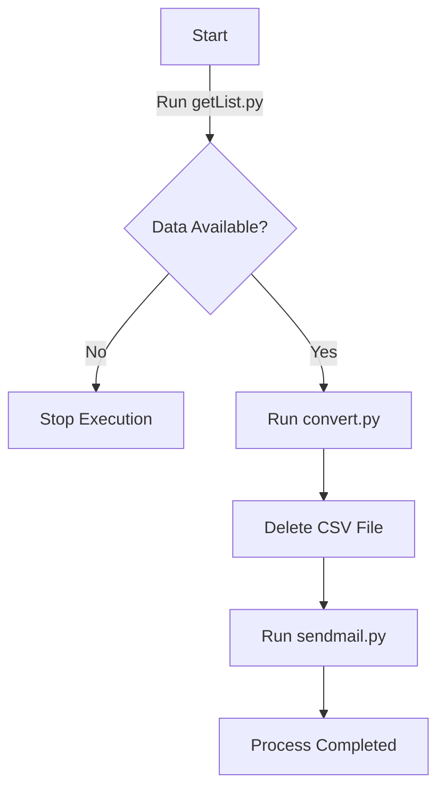

# 🚀 Automated Data Processing Pipeline

## 📌 Project Overview
This project automates the process of:
1. **Fetching data from an API** (`getList.py`).
2. **Converting the data** into an Excel file (`convert.py`).
3. **Deleting the temporary CSV file**.
4. **Sending an email notification** (`sendmail.py`).

The entire workflow is managed by `run.py`, ensuring a **smooth and structured execution** of each step.

---

## 📥 Installation & Dependencies
### 🔧 Prerequisites
Make sure you have **Python 3.8+** installed along with the required dependencies:

For **macOS/Linux**, run:
```bash
python3 -m venv venv
source venv/bin/activate
python3 -m pip install --user pandas
python3 -m pip install --user openpyxl
python3 -m pip install --user beautifulsoup4 requests
```

Ensure that `sendmail.py` is configured correctly with your **SMTP settings** before running the script.

---

## 🚀 How to Use
To execute the entire pipeline, simply run:
```bash
python3 run.py
```
This will automatically:
1. Fetch the data from the API.
2. Convert it to an Excel file.
3. Remove the temporary CSV file.
4. Send an email notification.

---

## 📜 Script Details
### 1️⃣ **getList.py** - Fetch Data
- Fetches JSON data from the API.
- Extracts required fields.
- Saves the data as a CSV file.
- Prints the **count of records** for further processing.

### 2️⃣ **convert.py** - Convert CSV to Excel
- Reads the generated CSV file.
- Formats the data with headers and column widths.
- Creates or updates an Excel file (`.xlsx`).
- Appends new data if the file already exists.

### 3️⃣ **run.py** - Orchestrator
- Runs `getList.py` in a loop, paginating through API results.
- Runs `convert.py` only if `getList.py` returns **non-empty results**.
- Deletes the CSV file after conversion.
- Sends an email with the final Excel file (`sendmail.py`).
- Runs `python3 runActive.py` in a loop, paginating through API results.

### 4️⃣ **sendmail.py** - Send Email Notification
- Sends an email with the processed Excel file as an attachment.
- Uses an SMTP server for email delivery.
- try to run: `python3 sendmail.py "data-active-past/filename.xlsx"`

---

## 🔄 Workflow


---

## ⏳ Scheduling with Cron (Linux/macOS)
To schedule `run.py` to execute **every day at 12:05 AM**, add the following cron job:

1. Open crontab:
```bash
crontab -e
```

2. Add this line at the bottom:
```bash
5 0 * * * /usr/bin/python3 /path/to/run.py >> /path/to/logs/cronjob.log 2>&1
```

3. Save and exit.

To verify the scheduled job:
```bash
crontab -l
```

To check logs:
```bash
cat /path/to/logs/cronjob.log
```

---

## 🛠 Troubleshooting
1. **No data is being fetched**
   - Check your API endpoint and credentials.
   - Ensure the API response contains expected data.

2. **Excel file is empty**
   - Verify that `getList.py` is retrieving data.
   - Check CSV file contents before conversion.

3. **Email is not being sent**
   - Confirm SMTP credentials are correctly configured.
   - Check logs for email sending errors.

---

## 📌 Logs & Debugging
Each script prints **detailed output** to the console. If an error occurs, check the logs in the terminal.

For debugging, run each script manually:
```bash
python3 getList.py 1
python3 convert.py
python3 sendmail.py
```

---

## 🎯 Summary
This pipeline **automates data extraction, conversion, cleanup, and notification**, ensuring a seamless process for managing structured data. 🚀

Happy Coding! 😊

crontab

1. Open the crontab editor:
crontab -e

If you're using Vim:
Press ESC to ensure you're in normal mode
Type :wq and press Enter (this saves and exits)
If you want to exit without saving, type :q! and press Enter

2. Add the cron job:
At the bottom of the file, add the following line:
5 0 * * * /path/to/your/script.sh
Explanation:
5 → Run at minute 5
0 → Run at hour 0 (midnight)
* * * → Every day, every month, every weekday
/path/to/your/script.sh → Replace with the actual path to your script.

3. Verify your cron job:
To confirm that your cron job has been added, run:
crontab -l

4. Ensure the script has execution permission:
If your script is not executable, give it the necessary permissions:
chmod +x run.py


crontab
0 8-18/2 * * * cd /home/patrykprokop/getBusinessGOVData && /usr/bin/python3 /home/patrykprokop/getBusinessGOVData/run.py >> /home/patrykprokop/getBusinessGOVData/logs/cron_$(date +\%Y\%m\%d_\%H\%M\%S).log 2>&1